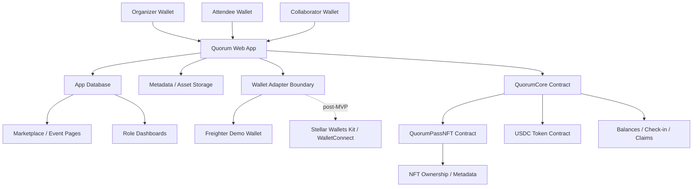
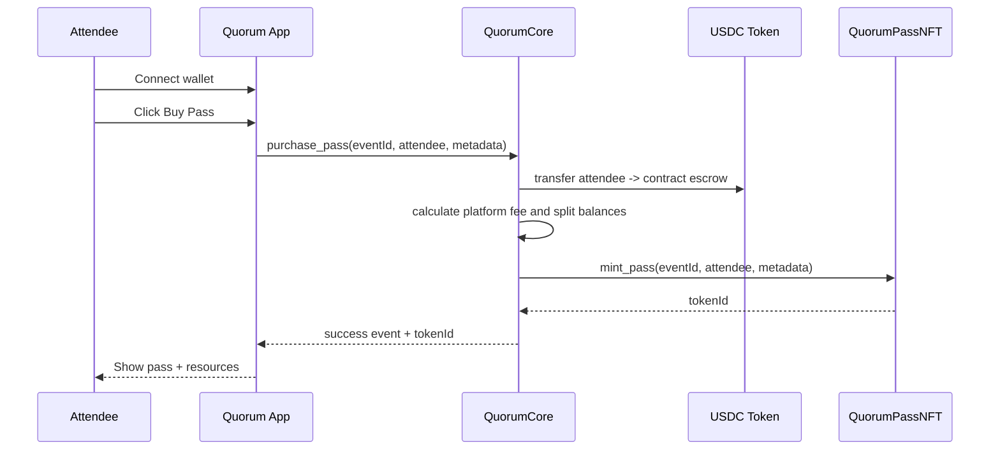

# Quorum Technical Specification

## 1. Product Summary

Quorum is a Stellar-native collaborative event checkout platform for Web3 events.

Quorum helps Web3 organizers sell event access, define transparent revenue splits for collaborators, mint wallet-linked NFT event passes, verify attendee access, and expose payout proof through dashboards.

Primary positioning:

> Luma helps one organizer run an event. Quorum helps multiple collaborators build, monetize, and verify an event together.

Quorum is intentionally not a full Luma/Eventbrite clone. The MVP includes enough event platform surface to make checkout usable, but the core product is the programmable money, access, and proof layer.

## 2. MVP Goals

The MVP must prove one polished hackathon demo flow:

> A Web3 organizer creates a paid builder meetup, adds collaborators and split percentages, publishes the event, an attendee pays with Stellar testnet USDC, the contract records escrow balances, Quorum mints a unique non-transferable NFT pass, the attendee unlocks resources, the organizer checks in the attendee, and collaborators can view and withdraw their balances.

MVP success means judges can see:

- a user-facing app;
- real wallet interaction;
- Stellar/Soroban used for core value, not as decoration;
- programmable split payout;
- unique NFT access pass;
- resource unlock and check-in;
- role-based transparency dashboards;
- transaction/proof surfaces.

## 3. MVP Scope

### Event Scope

- Web3 organizer can create a draft event.
- Event can be published publicly.
- Event lifecycle is `Draft -> Published`.
- Published event appears in the marketplace.
- Event supports paid or free access.
- Event supports one pass type per event.
- Event supports capacity.
- Event supports resources gated by pass ownership.
- Event supports check-in.

### Checkout Scope

- Attendee connects wallet before purchase or claim.
- Paid event uses Stellar testnet USDC.
- Free event uses wallet-based claim.
- One wallet can own at most one pass per event.
- Successful purchase or claim mints one unique NFT pass.

### Collaboration Scope

- Organizer defines collaborators while event is draft.
- Collaborator entries include display name, role, wallet address, and split percentage.
- Split must total 100% in the UI.
- Split is locked after publish.
- Collaborator balances are recorded by the contract.
- Collaborators withdraw their own balances.

### Dashboard Scope

- Organizer dashboard shows events, sales, capacity, split, attendees, check-in status, proof links, and balances.
- Collaborator dashboard shows events they are part of, split percentage, earned balance, withdrawn amount, and withdraw action.
- Attendee dashboard shows owned passes, pass detail, resource unlock, payment/claim proof, and check-in status.

## 4. Explicit Non-Scope

MVP will not include:

- ticket tiers;
- resale;
- transferable passes;
- refunds;
- fiat payments;
- mainnet production claims;
- email/password auth;
- email reminders;
- calendar sync;
- full CRM;
- complex agenda builder;
- recurring events;
- waitlists;
- collaborator approval workflow;
- private/unlisted event visibility;
- marketplace ranking/recommendation;
- production compliance features.

## 5. User Roles

### Organizer

Creates and publishes events, defines collaborators and split percentages, manages resources, monitors sales, and checks in attendees.

### Collaborator

Receives a defined split percentage, views payout proof, and withdraws earned balance.

Examples:

- speaker;
- mentor;
- community partner;
- venue partner;
- sponsor;
- co-host.

### Attendee

Connects wallet, purchases or claims pass, receives unique NFT pass, accesses gated resources, and presents pass for check-in.

### Platform Admin

Not a full product role for MVP. Platform fee support exists in the contract, but admin UI is not required for MVP.

## 6. Core User Flows

### 6.1 Organizer Creates Draft Event

1. Organizer connects wallet.
2. Organizer opens `Create Event`.
3. Organizer fills event metadata:
   - title;
   - type;
   - short description;
   - cover image;
   - start/end date and time;
   - timezone;
   - location type;
   - location text or meeting URL;
   - capacity;
   - price in USDC or free.
4. Organizer adds collaborators:
   - display name;
   - role;
   - wallet address;
   - split percentage.
5. UI validates split total equals 100%.
6. Organizer adds gated resources.
7. Event remains editable while draft.

### 6.2 Organizer Publishes Event

1. Organizer reviews draft.
2. Organizer clicks `Publish`.
3. App validates required metadata and split.
4. App writes on-chain event configuration to `QuorumCore`.
5. App stores published status and on-chain IDs in database.
6. Event becomes public in marketplace.
7. Split is locked.

### 6.3 Paid Attendee Purchase

1. Attendee opens public event page.
2. Attendee connects wallet.
3. App checks:
   - event is published;
   - event is paid;
   - capacity remains;
   - wallet does not already own a pass.
4. Attendee confirms purchase.
5. Wallet signs contract transaction.
6. `QuorumCore` transfers testnet USDC from attendee into escrow.
7. `QuorumCore` calculates collaborator balances.
8. `QuorumCore` instructs or authorizes `QuorumPassNFT` to mint pass.
9. `QuorumPassNFT` mints unique non-transferable token.
10. App records transaction hash and token ID.
11. Attendee sees pass page and unlocked resources.

### 6.4 Free Event Claim

1. Attendee opens public free event page.
2. Attendee connects wallet.
3. App checks:
   - event is published;
   - event is free;
   - capacity remains;
   - wallet does not already own a pass.
4. Attendee clicks `Claim Pass`.
5. Wallet signs contract transaction.
6. `QuorumCore` records claim and capacity usage.
7. `QuorumPassNFT` mints unique non-transferable token.
8. App records transaction hash and token ID.
9. Attendee sees pass page and unlocked resources.

### 6.5 Collaborator Withdraws Balance

1. Collaborator connects wallet.
2. Dashboard identifies events where wallet is a collaborator.
3. Dashboard shows earned and withdrawn balances.
4. Collaborator clicks `Withdraw`.
5. Wallet signs withdraw transaction.
6. `QuorumCore` validates collaborator identity and balance.
7. `QuorumCore` transfers USDC from escrow to collaborator wallet.
8. Dashboard records withdraw transaction hash.

### 6.6 Attendee Unlocks Resources

1. Attendee connects wallet.
2. Attendee opens resource page.
3. App checks pass ownership through contract/client state.
4. If wallet owns valid pass, resource page unlocks.
5. If wallet does not own pass, resource page shows locked state and link to event page.

MVP resource unlock mode is `after_purchase`.

### 6.7 Organizer Checks In Attendee

1. Attendee opens pass page.
2. Pass page shows token ID and QR/verification code.
3. Organizer opens check-in dashboard.
4. Organizer scans or enters token/pass identifier.
5. App checks NFT pass ownership and event match.
6. Organizer confirms check-in.
7. Wallet signs or organizer-authorized transaction marks pass checked in on `QuorumCore`.
8. Pass and dashboard show checked-in status.

## 7. System Architecture



### Application Layers

- Frontend: event creation, marketplace, checkout, dashboard, pass page, resources, check-in.
- Backend/API: session validation, DB writes, metadata generation, contract transaction preparation where needed, dashboard aggregation.
- Database: app metadata and cached proof records.
- Storage: cover images and NFT metadata JSON.
- Smart contracts: event proof, escrow, split balances, NFT pass minting, pass ownership, and check-in status.

## 8. On-Chain vs Off-Chain Source Of Truth

| Domain | Source of Truth | Notes |
|---|---|---|
| Event title/description/cover | Database/storage | UI metadata, editable in draft. |
| Event type/location/time | Database | Also included in metadata hash snapshot where useful. |
| Published event ID | Contract + DB | Contract is proof; DB powers UX. |
| Organizer wallet | Contract | Critical authorization data. |
| Price/capacity | Contract | Must be enforceable during purchase/claim. |
| Paid/free mode | Contract | Determines purchase vs claim behavior. |
| Collaborator wallets | Contract | Money destination proof. |
| Split percentages | Contract | Locked after publish. UI uses percentages; contract uses integer representation. |
| Platform fee | Contract | Demo 0%; production candidate 2.5%. |
| Purchases/claims | Contract | Prevent duplicate pass per wallet. |
| NFT pass ownership | `QuorumPassNFT` | Access proof. |
| NFT metadata URI/hash | `QuorumPassNFT` | Metadata URI points off-chain; hash proves integrity. |
| Capacity used/sold count | Contract | DB may cache for dashboard. |
| Collaborator balances | Contract | Withdrawable money proof. |
| Withdrawals | Contract | DB records tx hash for UX. |
| Check-in status | Contract | Verifiable attendance state. |
| Resource content/links | Database | Gated by NFT ownership. |
| Dashboard analytics | DB + contract reads | Contract for truth, DB for UX/cache. |

## 9. Smart Contract Specification

MVP uses two contracts:

- `QuorumCore`;
- `QuorumPassNFT`.

The exact Rust signatures may be adjusted during implementation, but the responsibilities and invariants below must hold.

### 9.1 QuorumCore Responsibilities

`QuorumCore` manages:

- event registry;
- event publish state;
- paid/free event mode;
- organizer authorization;
- capacity;
- split configuration;
- escrow accounting;
- platform fee accounting;
- purchase/claim state;
- collaborator balances;
- withdraw;
- check-in state;
- integration with `QuorumPassNFT`.

### 9.2 QuorumCore Core Data

Suggested storage model:

```txt
Event {
  event_id: BytesN<32> or Symbol/String-equivalent,
  organizer: Address,
  price: i128,
  currency: Address,
  capacity: u32,
  sold_count: u32,
  is_free: bool,
  published: bool,
  platform_fee_percent_scaled: u32,
  metadata_hash: BytesN<32>,
  pass_contract: Address
}

SplitRecipient {
  wallet: Address,
  percent_scaled: u32
}

PurchaseKey {
  event_id,
  attendee
}

BalanceKey {
  event_id,
  collaborator
}

CheckInKey {
  event_id,
  token_id
}
```

Implementation note:

- UI shows percentages such as `70%`.
- Contract should avoid floating point and store scaled integers, for example `7000` for `70.00%`.
- Technical spec should explain this as an internal representation while preserving percentage UX.

### 9.3 QuorumCore Functions

Suggested function set:

```txt
initialize(admin, pass_contract, currency, platform_fee_percent)
create_event(event_id, organizer, price, capacity, is_free, metadata_hash)
set_event_split(event_id, recipients)
publish_event(event_id)
purchase_pass(event_id, attendee, pass_metadata_uri, pass_metadata_hash)
claim_free_pass(event_id, attendee, pass_metadata_uri, pass_metadata_hash)
withdraw(event_id, collaborator)
check_in(event_id, token_id)
has_pass(event_id, attendee) -> bool
get_event(event_id)
get_balance(event_id, collaborator)
get_check_in_status(event_id, token_id)
```

Implementation note:

- Function naming can change if Stellar/Soroban client generation prefers shorter names.
- Authorization must be explicit. Organizer-only functions must require organizer auth.
- Purchase/claim must require attendee auth.
- Withdraw must require collaborator auth.

### 9.4 QuorumCore Events

Suggested emitted events:

```txt
event_created(event_id, organizer)
event_published(event_id)
split_locked(event_id)
pass_purchased(event_id, attendee, token_id, amount)
pass_claimed(event_id, attendee, token_id)
balance_credited(event_id, collaborator, amount)
withdrawn(event_id, collaborator, amount)
checked_in(event_id, token_id)
```

### 9.5 QuorumCore Invariants

- Draft event can be edited by organizer.
- Published event cannot change split.
- Split total must equal 100%.
- Paid event price must be greater than zero.
- Free event price must be zero.
- Sold/claimed count cannot exceed capacity.
- One wallet cannot buy or claim more than one pass for the same event.
- Only rightful collaborator can withdraw that collaborator balance.
- Withdraw cannot exceed recorded balance.
- Check-in can only happen for valid pass belonging to the event.
- Check-in should be idempotent or fail clearly if repeated.

## 10. NFT Pass Specification

### 10.1 NFT Model

Quorum uses a full NFT contract for event passes:

- contract name: `QuorumPassNFT`;
- model: one pass contract for all events;
- each pass is a unique token;
- each token maps to exactly one event;
- each token maps to one owner wallet;
- token is non-transferable;
- token metadata uses URI + hash;
- token ownership is the access proof.

One pass contract does not mean one shared NFT. It means all Quorum event passes live in one contract/collection. Each purchase or claim mints a new unique token ID.

Example:

```txt
QuorumPassNFT
  token #1 -> event APAC Builder Meetup, owner Wallet A
  token #2 -> event APAC Builder Meetup, owner Wallet B
  token #3 -> event DeFi Workshop, owner Wallet C
```

### 10.2 QuorumPassNFT Responsibilities

`QuorumPassNFT` manages:

- token ID generation;
- minting by authorized `QuorumCore`;
- token ownership;
- event ID per token;
- owner/event uniqueness lookup;
- metadata URI/hash;
- disabled transfer behavior.

### 10.3 QuorumPassNFT Suggested Data

```txt
Pass {
  token_id: u64,
  event_id: BytesN<32> or equivalent,
  owner: Address,
  metadata_uri: String,
  metadata_hash: BytesN<32>,
  minted_at_ledger: u32
}

OwnerEventKey {
  owner,
  event_id
}
```

### 10.4 QuorumPassNFT Functions

Suggested function set:

```txt
initialize(core_contract, admin)
mint_pass(event_id, owner, metadata_uri, metadata_hash) -> token_id
owner_of(token_id) -> Address
event_of(token_id) -> event_id
token_metadata(token_id) -> (metadata_uri, metadata_hash)
token_of_owner_for_event(owner, event_id) -> Option<token_id>
has_pass(owner, event_id) -> bool
```

Transfer-related functions must either:

- not be implemented; or
- always fail with a clear non-transferable error.

### 10.5 NFT Metadata

Metadata is stored off-chain and verified by hash.

Suggested JSON:

```json
{
  "name": "APAC Stellar Builder Meetup Pass #12",
  "description": "Non-transferable Quorum event pass for APAC Stellar Builder Meetup.",
  "image": "https://...",
  "eventId": "evt_apac_stellar_builder_meetup",
  "tokenId": "12",
  "eventType": "meetup",
  "accessType": "check-in + resource unlock",
  "owner": "G...",
  "issuedBy": "Quorum",
  "network": "stellar-testnet"
}
```

MVP can generate a standard Quorum visual pass using event cover, event title, and token number. Wallet/gallery rendering is not required for demo success; Quorum pass page is the canonical visual surface.

## 11. Payment, Escrow, Split, And Withdraw

### 11.1 Payment Asset

MVP supports only Stellar testnet USDC.

Implementation must confirm the correct testnet token contract/address during Phase 0/4. If token details change, update docs and env configuration before implementation.

### 11.2 Paid Purchase Flow



### 11.3 Split Strategy

User-facing split input uses percentages:

```txt
Organizer: 70%
Speaker: 20%
Community Partner: 10%
```

Internal contract representation should use scaled integers for precision. The technical implementation must define scale clearly and test rounding.

### 11.4 Platform Fee Strategy

Contract supports platform fee.

MVP values:

- demo platform fee: `0%`;
- production candidate: `2.5%`.

Suggested calculation:

1. Deduct platform fee from gross price.
2. Split remaining amount by collaborator percentages.
3. Record balances.

If demo fee is `0%`, gross amount equals split base.

### 11.5 Withdraw Flow

Collaborators withdraw their own balances from escrow.

Rules:

- only collaborator wallet can withdraw its balance;
- organizer cannot withdraw collaborator balance;
- zero balance withdraw should fail clearly;
- withdraw emits proof event;
- app records tx hash for dashboard.

## 12. Free Event Claim Flow

Free event behavior:

- attendee connects wallet;
- one pass per wallet;
- capacity enforced;
- no USDC transfer;
- unique NFT pass minted;
- resources unlock after claim.

Free claim is useful for:

- free meetup registration;
- attendance proof;
- check-in;
- gated materials;
- future community perks.

## 13. Check-In And Resource Unlock

### 13.1 Resource Unlock

MVP resource unlock mode is after purchase or claim.

Resource examples:

- workshop deck;
- GitHub starter repo;
- meeting link;
- recording link;
- private notes;
- sponsor perk.

Resource content is stored in the database and displayed only if the connected wallet owns a valid pass for the event.

### 13.2 Check-In

Check-in status is on-chain.

Recommended MVP flow:

- attendee opens pass page;
- pass page shows token ID and QR/verification code;
- organizer opens check-in page;
- organizer scans/enters token;
- app verifies token event and owner;
- organizer confirms check-in;
- `QuorumCore` records checked-in status.

Security note:

- A static QR alone can be screenshotted.
- MVP can accept this risk if QR contains token ID and organizer dashboard verifies owner/event/check-in state.
- Stronger v2 can require attendee wallet challenge signature at check-in.

## 14. Database Schema Draft

The exact schema may change based on framework/ORM choice, but the MVP needs these entities.

### User

```txt
id
walletAddress
createdAt
lastSeenAt
```

### Event

```txt
id
slug
title
eventType
shortDescription
coverImageUrl
startDateTime
endDateTime
timezone
locationType
locationText
meetingUrl
priceUsdc
isFree
capacity
status: draft | published
organizerWallet
metadataHash
coreEventId
publishTxHash
createdAt
updatedAt
```

### Collaborator

```txt
id
eventId
displayName
role
walletAddress
splitPercentage
createdAt
```

### Resource

```txt
id
eventId
title
description
type
url
sortOrder
createdAt
```

### Pass

```txt
id
eventId
ownerWallet
tokenId
metadataUri
metadataHash
mintTxHash
source: purchase | free_claim
checkedIn
createdAt
```

### Purchase

```txt
id
eventId
buyerWallet
amountUsdc
tokenId
txHash
status
createdAt
```

### Withdrawal

```txt
id
eventId
collaboratorWallet
amountUsdc
txHash
createdAt
```

### CheckIn

```txt
id
eventId
tokenId
ownerWallet
checkedInByWallet
txHash
createdAt
```

## 15. API Route Plan

The API layer should stay thin. Contract state remains authoritative for money/access.

Suggested routes:

```txt
POST /api/auth/challenge
POST /api/auth/verify
POST /api/auth/logout
GET  /api/me

POST /api/events
GET  /api/events
GET  /api/events/:slug
PATCH /api/events/:id
POST /api/events/:id/collaborators
POST /api/events/:id/resources
POST /api/events/:id/publish

POST /api/events/:id/purchase/record
POST /api/events/:id/claim/record

GET  /api/passes
GET  /api/passes/:tokenId
GET  /api/events/:id/resources

POST /api/check-in/record

GET  /api/dashboard/organizer
GET  /api/dashboard/collaborator
GET  /api/dashboard/attendee
```

Implementation note:

- Contract transactions may be prepared client-side or through API helpers depending on SDK ergonomics.
- API `record` endpoints should not be treated as proof of money/access. They record successful transaction data for UX after contract confirmation.

## 16. Frontend Routes And Pages

Suggested routes:

```txt
/                         Marketplace
/events/[slug]            Public event page
/events/[slug]/checkout   Paid/claim flow
/events/[slug]/resources  Gated resources
/passes                   Attendee pass list
/passes/[tokenId]         Pass detail page
/dashboard                Role-aware dashboard home
/dashboard/events         Organizer event management
/dashboard/events/new     Create event draft
/dashboard/events/[id]    Organizer event detail
/dashboard/collaborator   Collaborator payout view
/dashboard/attendee       Attendee pass/resource view
/check-in/[eventId]       Organizer check-in page
```

## 17. Dashboard Specification

### Organizer Dashboard

Must show:

- event list;
- draft/published status;
- total sales;
- sold/claimed vs capacity;
- split table;
- collaborator balances;
- attendee list;
- token IDs;
- tx hashes;
- check-in status;
- resource list;
- check-in action.

Visual priority:

- polished cards/tables;
- clear proof badges;
- simple charts for sales/capacity if time allows;
- no complex analytics in MVP.

### Collaborator Dashboard

Must show:

- events where connected wallet is collaborator;
- role;
- split percentage;
- earned balance;
- withdrawn amount;
- pending balance;
- withdraw button;
- proof/tx links.

### Attendee Dashboard

Must show:

- owned passes;
- event info;
- token ID;
- payment/claim proof;
- resource access;
- checked-in status.

## 18. Wallet And Auth Specification

### Wallet Strategy

- Use an internal wallet adapter boundary so Quorum can support multiple Stellar wallets over time.
- Freighter is the primary demo wallet.
- Direct Freighter API integration is acceptable for MVP if the current Stellar Wallets Kit dependency tree introduces unacceptable audit risk.
- Stellar Wallets Kit and WalletConnect support should be revisited after the Freighter-first demo path is stable and dependency risk is acceptable.
- Wallet-only auth; no email/password.

Phase 2 correction record:

- `@creit.tech/stellar-wallets-kit@2.3.0` was evaluated for MVP integration.
- The package brought a large optional wallet dependency tree with npm audit findings including critical transitive issues.
- MVP implementation therefore uses a Freighter-first adapter with `@stellar/freighter-api`, while preserving a future multi-wallet boundary.

### Session Strategy

Recommended:

1. App requests auth challenge.
2. Wallet signs challenge.
3. API verifies signature.
4. API creates session.
5. UI uses session wallet address for role-based dashboard.

### Wallet Readiness

The app should show:

- connected wallet address;
- testnet network readiness;
- missing Freighter state;
- USDC readiness if feasible;
- helpful error messages for rejected signatures or transaction failures.

## 19. Testing Strategy

### Contract Tests

Must cover:

- event creation;
- split validation;
- publish locking;
- paid purchase;
- free claim;
- capacity enforcement;
- duplicate pass prevention;
- NFT uniqueness;
- NFT non-transferability;
- metadata storage;
- balance accounting;
- withdraw authorization;
- check-in status.

### API Tests

Should cover:

- auth challenge/verify;
- draft event CRUD;
- split validation;
- resource visibility checks;
- transaction record endpoints.

### Frontend Tests

Should cover:

- event creation form validation;
- marketplace rendering;
- event page paid/free states;
- dashboard role rendering;
- locked/unlocked resource states.

### E2E Demo Test

Must rehearse:

1. create event;
2. publish event;
3. purchase with Freighter;
4. mint pass;
5. view resource;
6. check in attendee;
7. collaborator withdraw or at least show withdrawable proof.

## 20. Deployment And Demo Strategy

### Environment

- Web app: Vercel or equivalent.
- Database/storage: local SQLite for autonomous MVP development; Supabase/Postgres or equivalent for hosted demo after credentials are available.
- Contracts: Stellar testnet.
- Wallet: Freighter testnet account.
- Asset: USDC testnet.

### Demo Seed Event

Recommended seed:

```txt
APAC Stellar Builder Meetup
Type: Paid Web3 Meetup + Mini Workshop
Price: 5 USDC
Capacity: 80
Split:
  Organizer: 70%
  Speaker: 20%
  Community Partner: 10%
Resources:
  Workshop Deck
  Soroban Starter Repo
  Private Builder Notes
```

### Evidence Checklist

Record:

- deployed app URL;
- contract IDs;
- demo wallet addresses;
- publish tx hash;
- purchase tx hash;
- pass token ID;
- withdraw tx hash if completed;
- screenshots of marketplace, event page, pass, resources, dashboard, check-in.

## 21. Risks And Fallbacks

| Risk | Impact | Mitigation |
|---|---|---|
| Full NFT contract takes longer than expected | Blocks access proof | Implement minimal non-transferable NFT surface first, then polish metadata/display. |
| Wallet integration unstable | Blocks demo | Freighter primary path, WalletConnect optional. |
| USDC testnet setup friction | Blocks purchase | Add wallet readiness panel and documented demo wallet preparation. |
| Escrow transfer/auth complexity | Blocks paid flow | Spike contract payment flow early before UI polish. |
| Dashboard reads slow/complex | Weak demo | Cache tx hashes and contract results in DB after confirmed transactions. |
| QR check-in screenshot risk | Weaker security | Accept for MVP; v2 adds wallet challenge at check-in. |
| Scope drift to event platform | Slows build | Keep full Luma features out of scope. |
| Refund questions | Judge concern | Explicitly state no refund MVP; v2 handles cancellation/refund. |

## 22. References

- Stellar smart contracts overview: https://developers.stellar.org/docs/build/smart-contracts/overview
- Stellar wallet integration: https://developers.stellar.org/docs/tools/developer-tools/wallets
- Stellar Wallets Kit docs: https://stellarwalletskit.dev
- OpenZeppelin Stellar contracts overview: https://docs.openzeppelin.com/stellar-contracts
- OpenZeppelin Stellar non-fungible token docs: https://docs.openzeppelin.com/stellar-contracts/tokens/non-fungible/non-fungible
