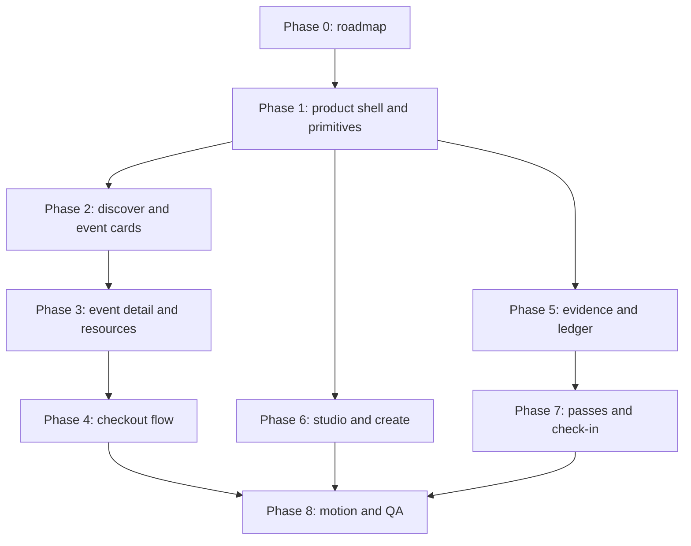

# Quorum App UI Refactor Roadmap

Last updated: 2026-07-07.

This document supersedes the older FE v2 notes for the next product UI pass.
The landing page has now become the strongest source of truth: it follows the
current APAC Stellar Figma direction, uses the new Quorum mark, and establishes
the cyan-on-near-black visual system. The rest of the app is functional, but it
does not yet feel like the same product.

## Executive Summary

Quorum should not become a technical console with a good landing page attached.
The app routes must inherit the new brand discipline while staying practical
for repeated product workflows.

The current state is:

- `/` is the strongest screen and should remain the brand north star.
- Product routes still use the old `AppShell`, old circular `Q` mark, gold
  accent, and mixed typography.
- Several pages use large marketing-style heroes where the user actually needs
  a focused product workflow.
- Proof, ledger, wallet, checkout, and pass flows are valuable, but they are
  presented with inconsistent surfaces and too many one-off card patterns.
- Some routes already contain a better proof-oriented component direction:
  `ProofSurface`, `StatusPill`, and `QuorumButton`. These should become the
  shared product UI foundation instead of inventing another system.

The refactor should happen through small PRs. Do not mix shell, discover,
checkout, ledger, pass, dashboard, and form behavior in one large change.

## Inputs Audited

Source of truth:

- Figma file: `APAC Stellar`
- Landing node: `181:757`
- Feature node: `243:4673`
- Current design tokens from Figma:
  - `Foundation/Grey/grey-900`: `#0C0B0B`
  - `Foundation/Grey/grey-800`: `#0F0F0F`
  - `Foundation/Grey/grey-700`: `#141313`
  - `Foundation/Grey/grey-600`: `#191919`
  - `Foundation/Grey/grey-500`: `#1C1B1B`
  - `Foundation/Grey/grey-400`: `#494949`
  - `Foundation/Grey/grey-200`: `#979696`
  - `Foundation/Grey/grey-100`: `#B9B8B8`
  - `Foundation/Blue/blue-500`: `#26C6DA`
  - Font family: `Outfit`

Local sources audited:

- `DESIGN.md`
- `docs/FRONTEND_REDESIGN.md`
- `docs/FE_V2_DESIGN_SPEC.md`
- `docs/FE_V2_QA_REPORT.md`
- `src/app/globals.css`
- `src/components/app-shell.tsx`
- `src/components/app-navigation.tsx`
- `src/components/ui/proof-surface.tsx`
- `src/components/ui/quorum-button.tsx`
- `src/components/ui/status-pill.tsx`
- `src/app/discover/page.tsx`
- `src/app/events/[slug]/page.tsx`
- `src/app/events/[slug]/checkout/page.tsx`
- `src/app/events/[slug]/proof/page.tsx`
- `src/app/events/[slug]/resources/page.tsx`
- `src/app/dashboard/page.tsx`
- `src/app/dashboard/events/new/page.tsx`
- `src/app/dashboard/ledger/page.tsx`
- `src/app/passes/page.tsx`
- `src/app/passes/[tokenId]/page.tsx`
- `src/app/evidence/page.tsx`
- `src/app/check-in/[eventId]/page.tsx`

Local browser audit:

- Captured desktop and mobile screenshots under
  `output/playwright/ui-audit/` using local dev server `http://localhost:3000`.
- Routes checked: `/`, `/discover`, seeded event detail, checkout, dashboard,
  create event, passes, evidence, and ledger.
- All checked routes returned HTTP 200.
- No horizontal overflow was detected in the audited desktop or mobile
  viewports.

## Current Product Diagnosis

### What Is Working

- The landing page now has a recognizable Quorum identity: black foundation,
  cyan signal, grid/orbit details, Outfit typography, and a composed structure.
- The app has a real route graph, not just mock screens.
- Checkout, publish, check-in, anchor payout, pass receipt, evidence, and ledger
  flows already have meaningful product behavior.
- `ProofSurface`, `StatusPill`, and `QuorumButton` are the best current shared
  product primitives.
- Browser QA already exists through `npm run browser:qa`.

### What Is Weak

- The app shell still feels like the old product:
  - circular `Q` mark instead of the Figma Quorum mark;
  - gold accent as the default;
  - copy such as "Events with wallet-native access";
  - preview/live badges competing with wallet CTA;
  - nav treatment that does not match the landing header.
- The visual system is split:
  - landing uses `--landing-*` and `--quorum-blue-*`;
  - many app pages use `--accent`, `--amber`, `text-accent`, and
    `bg-accent`;
  - proof pages use newer cyan components;
  - event pages inject dynamic event themes inconsistently.
- Many app pages use hero sections that are too large for operational flows.
  This is especially visible in `/dashboard`, `/dashboard/events/new`,
  `/passes`, and `/evidence`.
- The current layout often stacks panels and stat boxes before clarifying the
  next user action.
- Technical proof is visible, but it is not always explained in a user-first
  way. The UI should answer: "what happened, who is affected, what can I do
  next, and where is the proof?"
- The create event flow is a long form rather than a guided event setup flow.
- Discover feels more like a generic marketplace page than a curated event
  surface.

## Design North Star

Quorum app pages should feel like:

> A premium event operating surface where every paid event, access pass, and
> collaborator payout has visible proof without making users feel like they are
> operating blockchain infrastructure.

This means:

- Landing remains brand storytelling.
- Discover and event pages are event-first.
- Checkout, pass, resource, check-in, evidence, and ledger pages are proof-first
  product flows.
- Dashboard and create pages are workspace-first, not marketing pages.
- Technical terms are available, but they are not the first read.

## Locked Design Decisions

1. Product pages should use the same Quorum mark as the landing page.
2. Product pages should use Outfit as the primary UI font.
3. Product default accent should be cyan, not gold.
4. Gold should not be the global app accent. If retained, it should be a
   legacy event theme or a very limited warning/payment tone.
5. The product shell can be denser than the landing header, but it must inherit:
   black base, quiet grid, cyan focus, thin borders, and balanced spacing.
6. Event-specific dynamic color can exist inside event covers and event-specific
   CTAs, but it should not override the whole app shell.
7. Proof UI should be standardized around `ProofSurface`, `StatusPill`,
   `QuorumButton`, and future proof row/card primitives.
8. Checkout, publish, check-in, payout, and wallet flows are high-risk. UI PRs
   must avoid changing transaction behavior unless the PR is explicitly scoped
   for behavior.

## Product Route Audit

| Route | Current State | Main Problem | Target Direction | Priority |
|---|---|---|---|---|
| `/discover` | Functional event listing with search and carousel. | Old shell, gold accent, hero too large, event cards still feel generic. | Curated event discovery with compact intro, stronger search/filter, event-first cards, cyan trust hints. | P1 |
| `/events/[slug]` | Useful event detail with hero, checkout rail, facts, split, resources. | Mixed event theme and old accent; too many cards; proof details compete with event decision. | Event-first detail page with persistent CTA, split/resource proof as supporting sections. | P1 |
| `/events/[slug]/checkout` | Functional wallet checkout panel. | Transaction confidence is present but visually old; stepper is card-heavy. | Guided checkout with review, wallet, approval, submission, pass-ready states. | P1 |
| `/events/[slug]/proof` | Event-scoped timeline. | Looks like a stats header plus log rows. | Event proof room: scoped evidence summary, filter chips, timeline rows with explorer links. | P1 |
| `/events/[slug]/resources` | Locked/unlocked resources work. | Access state is visually plain and old-accent. | Pass-gated resource surface with clear locked, unlocked, wrong-wallet, and empty states. | P2 |
| `/passes` | Pass library with event cards. | Empty state and pass list still old accent; pass visual not special enough. | Wallet pass library with access-object cards and clearer ownership states. | P2 |
| `/passes/[tokenId]` | Strongest product proof page; uses `ProofSurface`. | Good direction but isolated from other pages. | Make this the model for proof/pass/receipt components. | P0 foundation |
| `/dashboard` | Role summary and operational panels. | Too much landing-size hero; role model is not explicit enough; old accent. | Studio cockpit with role tabs, compact metrics, next action rail, proof/readiness aside. | P1 |
| `/dashboard/events/new` | Long creator form with defaults. | Hero too large; no guided setup structure; split/resource fields feel dense. | Guided event setup with sections, sticky preview, split validation, publish gate. | P1 |
| `/dashboard/ledger` | Collaborator ledger plus anchor payout rail. | Some cyan proof primitives, but mixed old buttons and table/list treatment. | Collaborator payout workspace with proof-aware ledger, anchor rail, and payout status states. | P1 |
| `/evidence` | Global proof timeline. | Hackathon-critical but not yet judge-friendly enough. | Live transaction evidence hub with event filter, proof categories, explorer affordances, and scoped links. | P0/P1 |
| `/check-in/[eventId]` | Functional organizer check-in tool. | Good proof primitives but layout can be faster and more event-door focused. | Door-mode tool: token scan/input first, stats second, recent proofs third. | P2 |

## Reusable Component Strategy

### Product Shell Layer

Create or refactor toward:

- `ProductShell`
  - Replaces or evolves `AppShell`.
  - Uses the landing Quorum logo.
  - Uses cyan default accent.
  - Supports sticky/glass behavior without the old hard border treatment.
  - Exposes clear nav groups: `Discover`, `Studio`, `Create`, `Passes`,
    `Evidence`.
  - Keeps wallet state visible but calm.

- `ProductNav`
  - Active route highlight using cyan, not gold.
  - Mobile bottom/top nav must stay usable and avoid text overflow.

- `ProductPage`
  - Shared page background with grid/cyan atmosphere.
  - Configurable density: `brand`, `browse`, `workflow`, `proof`, `workspace`.

### Shared Surfaces

Build on existing primitives:

- `ProofSurface`
  - Promote from proof pages to general product surfaces.
  - Add size/density variants: `default`, `compact`, `hero`, `table`.

- `StatusPill`
  - Keep tone variants, but default app tone should be cyan.
  - Add status semantics: `ready`, `pending`, `live`, `local`, `blocked`,
    `success`, `warning`, `danger`.

- `QuorumButton`
  - Use for app actions.
  - Add clear variants: `primary`, `secondary`, `ghost`, `danger`,
    `subtle`.
  - Keep icon behavior consistent.

Add new reusable components:

- `ProductPageHeader`
  - For compact route headers.
  - Prevents every app route from becoming a giant hero.

- `SectionHeader`
  - Eyebrow/label, title, description, optional action.
  - Replaces scattered `eyebrow` paragraphs.

- `MetricTile`
  - Consistent number, unit, caption, delta/status.
  - Used in dashboard, evidence, ledger, check-in.

- `EventCard`
  - Shared event listing card.
  - Supports featured and compact variants.

- `PassCard`
  - Shared pass library visual.
  - Should look like an access object, not only a generic card.

- `EvidenceRow`
  - Standard proof row for global evidence, event proof, pass proof, ledger.
  - Must support status, amount, actor wallet, tx hash, ledger, explorer link,
    and source label.

- `WalletGate`
  - Standard empty/blocked state when a wallet is required.

- `EmptyState`
  - Reusable and specific, not a generic box with an icon.

- `FormSection`
  - For create event flow sections with validation and helper copy.

- `SplitPreview`
  - Shared visualization for revenue split across event detail, checkout,
    create, and dashboard.

### Visual Motifs To Reuse Carefully

Reuse:

- thin cyan edge-lit borders;
- subtle grid only when it supports structure;
- orbit/line motif for proof and split flows;
- oversized wordmark only in landing/footer contexts;
- black-to-transparent overlays for visual cards.

Avoid:

- random glow blobs;
- repeated 3-card grids;
- card-inside-card layouts;
- large hero typography inside operational tools;
- long technical IDs as primary page content;
- gold as default active color.

## Recommended User Flow

Primary visitor path:

1. `/`
2. `/discover`
3. `/events/[slug]`
4. `/events/[slug]/checkout`
5. `/passes/[tokenId]`
6. `/events/[slug]/resources`
7. `/check-in/[eventId]` when organizer verifies access
8. `/events/[slug]/proof` or `/evidence` when proof is needed

Organizer path:

1. `/dashboard/events/new`
2. save draft
3. publish with explicit wallet approval
4. `/dashboard`
5. event detail and event proof
6. check-in and ledger

Collaborator path:

1. `/dashboard`
2. `/dashboard/ledger`
3. anchor payout rail
4. event proof and evidence links

## Development Plan

Each phase below should be its own issue/branch/PR unless two adjacent phases
are tiny and tightly coupled. Every phase must commit before moving to the next
phase.

### Phase 0 - Planning Artifact

Scope:

- Add this roadmap.
- Record current audit findings.
- Link the work to issue `#9`.

Acceptance criteria:

- Roadmap identifies affected routes, component strategy, phase order, risks,
  and acceptance criteria.
- No app behavior changes.
- `npm run lint` and `npm run build` pass, or failures are documented.
- PR links `Closes #9`.

### Phase 1 - Product Foundation And Shell

Scope:

- Replace/evolve `AppShell` into the new product shell.
- Use the same Quorum mark/logo vocabulary as landing.
- Move product default from gold to cyan.
- Add shared `ProductPage`, `ProductPageHeader`, `SectionHeader`, `MetricTile`,
  `WalletGate`, and `EmptyState`.
- Align `QuorumButton`, `StatusPill`, and `ProofSurface` variants.
- Update global product tokens without breaking `.landing-shell`.

Acceptance criteria:

- `/discover`, `/dashboard`, `/passes`, `/evidence`, and `/dashboard/ledger`
  render with the new shell.
- Landing visuals remain unchanged.
- Active nav state uses cyan.
- Wallet button has disconnected, checking, connected, and error states.
- Desktop screenshot: 1440 x 900 for affected routes.
- Mobile screenshot: 390 x 844 for affected routes.
- No horizontal overflow.
- `npm run lint` and `npm run build` pass.
- Browser QA still passes or route-specific changes are documented.

### Phase 2 - Discover And Event Card System

Scope:

- Refactor `/discover`.
- Build shared `EventCard` and featured event rail.
- Replace the oversized discover hero with a compact browse header.
- Improve search/filter placement.
- Show event essentials: date, title, host/location, price, capacity, pass
  status, and small proof hint.

Acceptance criteria:

- `/discover` feels like an event platform, not an internal marketplace.
- Event card visual hierarchy is title/date/CTA first, proof second.
- Empty search state is clear and has a recovery action.
- Mobile cards are designed, not squeezed.
- Event covers load and crop intentionally.
- Desktop and mobile screenshots are reviewed before commit.
- `npm run lint`, `npm run build`, and `npm run browser:qa` pass or failures are
  documented.

### Phase 3 - Event Detail And Event Resources

Scope:

- Refactor `/events/[slug]`.
- Refactor `/events/[slug]/resources`.
- Add shared `SplitPreview`.
- Use event-specific accent only inside event surfaces.
- Keep primary CTA visible above the fold and sticky/persistent on mobile if
  needed.
- Add locked, unlocked, wrong-wallet, and no-resource states for resources.

Acceptance criteria:

- Event detail is event-first: title, date, location, price, capacity, and CTA
  are immediately understandable.
- Split and proof details support trust without dominating the page.
- Resource page explains access state in plain language.
- Mobile event detail keeps checkout action reachable.
- No transaction, wallet, or resource access behavior changes.
- Desktop and mobile screenshots are reviewed before commit.
- `npm run lint`, `npm run build`, and route smoke/browser checks pass or
  failures are documented.

### Phase 4 - Checkout And Pass Issuance Flow

Scope:

- Refactor `/events/[slug]/checkout`.
- Refactor `CheckoutPanel` UI only.
- Add guided states: review, connect wallet, approve in wallet, submitting,
  pass ready, error, sold out, already owns pass if available from API.
- Make split preview and signing explanation calm and short.

Acceptance criteria:

- Checkout explains amount, wallet, network, split, expected result, and
  Freighter approval before submission.
- Loading and error states are visible and recoverable.
- Disabled/sold-out state is visually clear.
- No live signing logic changes unless a separate high-risk PR explicitly
  scopes that behavior.
- Desktop and mobile screenshots are reviewed before commit.
- `npm run lint`, `npm run build`, `npm run wallet:auth:smoke`, and relevant
  checkout/live smoke scripts pass or unverified live signing is documented.

### Phase 5 - Evidence, Event Proof, And Ledger

Scope:

- Refactor `/evidence`.
- Refactor `/events/[slug]/proof`.
- Refactor `/dashboard/ledger`.
- Create shared `EvidenceRow`, `EvidenceSummary`, and `ProofFilterBar`.
- Make global evidence judge-friendly:
  - all Quorum evidence;
  - event-scoped evidence;
  - tx hash availability;
  - explorer link;
  - ledger/source label;
  - local versus live proof clearly labeled.
- Align anchor payout history with proof surfaces.

Acceptance criteria:

- `/evidence` reads as a live transaction evidence hub, not a raw log.
- Event proof clearly scopes rows to one event.
- Ledger clearly scopes rows to the connected collaborator wallet.
- Proof labels do not overclaim live transactions when proof is local.
- Explorer links remain available when a tx hash exists.
- Empty/error database states are designed.
- Desktop and mobile screenshots are reviewed before commit.
- `npm run lint`, `npm run build`, `npm run settlement:smoke`,
  `npm run anchor:status:smoke`, and evidence/browser checks pass or external
  constraints are documented.

### Phase 6 - Studio Dashboard And Create Event Flow

Scope:

- Refactor `/dashboard`.
- Refactor `/dashboard/events/new`.
- Create role-aware Studio layout:
  - organizer;
  - collaborator;
  - attendee.
- Convert the create page from one long form into guided sections with a sticky
  preview or summary rail.
- Keep publish/save behavior unchanged.

Acceptance criteria:

- Dashboard prioritizes next actions over decorative metrics.
- Organizer, collaborator, and attendee states are understandable when empty
  and when populated.
- Create event flow shows setup progress and validation status.
- Split total validation is obvious.
- Wallet requirement is visible before save/publish.
- Form controls have clear focus, disabled, error, and loading states.
- No publish/signing behavior changes unless separately scoped.
- Desktop and mobile screenshots are reviewed before commit.
- `npm run lint`, `npm run build`, `npm run wallet:auth:smoke`, and relevant
  event API smoke checks pass or missing env is documented.

### Phase 7 - Pass Library, Pass Detail, And Check-In

Scope:

- Refactor `/passes`.
- Polish `/passes/[tokenId]` using the same product proof system.
- Refactor `/check-in/[eventId]`.
- Create shared pass/access components:
  - `PassCard`;
  - `PassReceiptPanel`;
  - `AccessStatePanel`;
  - `CheckInScannerPanel`.

Acceptance criteria:

- Pass library feels like a wallet access collection, not a generic list.
- Pass detail keeps receipt/proof useful without overwhelming the event title.
- Check-in route is optimized for door speed: token input, action, result,
  recent check-ins.
- QR/token states are clear.
- Empty pass and no-check-in states are designed.
- Desktop and mobile screenshots are reviewed before commit.
- `npm run lint`, `npm run build`, `npm run wallet:auth:smoke`, and check-in
  smoke coverage pass or external constraints are documented.

### Phase 8 - Motion, Responsive Polish, And QA

Scope:

- Add small motion only where it improves comprehension.
- Standardize hover/focus/active/disabled/loading states.
- Update browser QA coverage for all major app routes.
- Add screenshot audit guidance to docs if needed.

Acceptance criteria:

- Motion respects `prefers-reduced-motion`.
- Hover/focus states are consistent across nav, cards, buttons, rows, and form
  controls.
- No route has incoherent overlap or text overflow at 1440 x 900 and 390 x 844.
- `npm run browser:qa` checks landing, discover, event detail, checkout,
  resources, dashboard, create, passes, evidence, and ledger.
- Final screenshots are captured and reviewed.
- `npm run lint` and `npm run build` pass.

## Phase Dependency Map

## What Can Run In Parallel

After Phase 1 lands:

- Phase 2 and Phase 5 can run in parallel if they do not both edit shared
  primitives.
- Phase 6 can run in parallel with Phase 2 if `ProductPageHeader`,
  `MetricTile`, `StatusPill`, and `QuorumButton` contracts are already locked.
- Phase 7 should wait for Phase 5 if it will reuse `EvidenceRow` and proof
  status labels.
- Phase 4 should wait for Phase 3 because checkout depends on the event detail
  information hierarchy and split presentation.

Do not run these in parallel:

- Phase 1 with any route-heavy refactor.
- Checkout UI changes with live signing behavior changes.
- Create event UI changes with publish transaction behavior changes.
- Ledger visual refactor with payout status behavior changes.

## Autonomous Blockers

These are the things that can block autonomous execution:

1. Missing final Figma nodes for product app pages.
   - Workaround: use landing, feature grid, testimonial, FAQ, and current
     product proof components as the source of truth.
   - Needed from Wildan only if exact product-page Figma mocks exist and must be
     followed.

2. Wallet/live transaction states.
   - UI can be refactored without live signing.
   - Live signing verification still requires explicit approval and the right
     testnet wallet/env.

3. Database state.
   - Browser screenshots can use seeded demo data.
   - Pass detail screenshots need an owned pass token. If no pass exists,
     create one through local smoke/demo flow or document the missing state.

4. Anchor/MoneyGram behavior.
   - Visual layout can be refactored.
   - Real anchor approval and hosted callback behavior are external and should
     not be claimed as verified unless tested.

5. Scope creep.
   - The refactor should not redesign smart contract, DB, anchor, or settlement
     behavior in the same PR as UI polish.

## Loop Engineering Gate For Every Phase

Every UI PR should follow this loop:

1. Read route code and shared components.
2. State the screen purpose, user role, primary action, and state matrix.
3. Implement the smallest complete phase.
4. Run the app.
5. Capture desktop and mobile screenshots.
6. Critique screenshots against Figma/landing:
   - hierarchy;
   - color balance;
   - spacing;
   - container use;
   - copy;
   - mobile fit;
   - interaction states.
7. Fix before committing if the screenshot is not acceptable.
8. Run verification commands.
9. Commit.
10. Push and open/update PR.

## Verification Matrix

| Change Area | Required Checks |
|---|---|
| Shell/navigation/tokens | `npm run lint`, `npm run build`, browser screenshots, `npm run browser:qa` |
| Discover/event detail | `npm run lint`, `npm run build`, browser screenshots, `npm run browser:qa` |
| Checkout/wallet UI | `npm run lint`, `npm run build`, `npm run wallet:auth:smoke`, no unapproved live signing |
| Evidence/ledger | `npm run lint`, `npm run build`, `npm run settlement:smoke`, relevant evidence/anchor smoke |
| Anchor payout UI | `npm run lint`, `npm run build`, `npm run anchor:status:smoke`, document sandbox/live status |
| Create event | `npm run lint`, `npm run build`, form browser checks, no publish behavior change unless scoped |
| Pass/check-in | `npm run lint`, `npm run build`, `npm run wallet:auth:smoke`, check-in browser checks |

## Suggested Issue Breakdown

Create follow-up issues from this roadmap:

1. `ui: align product shell with Quorum landing system`
2. `ui: refactor discover into event-first browse surface`
3. `ui: refactor event detail and gated resources`
4. `ui: redesign checkout approval states`
5. `ui: redesign evidence, event proof, and collaborator ledger`
6. `ui: redesign Studio dashboard and create event flow`
7. `ui: polish pass library, pass receipt, and check-in`
8. `test: expand browser QA for app-wide UI routes`

## Immediate Next Recommendation

Do Phase 1 first. The shell and primitives are the highest leverage work. If
route pages are refactored before Phase 1, the team will keep copying old
patterns and then pay the cleanup cost again.

Phase 1 is also low behavioral risk if kept to visual primitives, nav, and
tokens. It gives every later PR a stable vocabulary.
