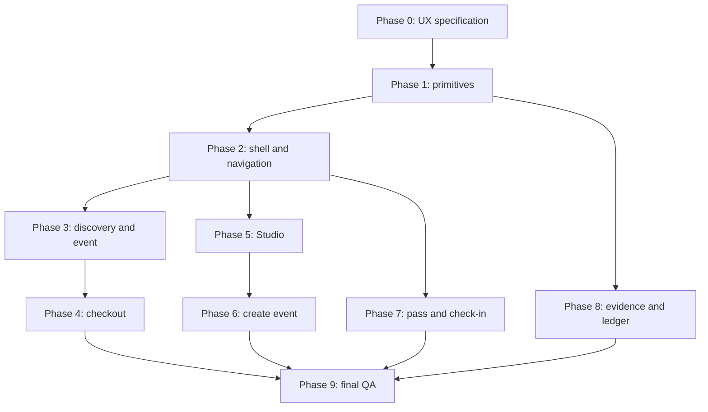

# Quorum Product UI/UX Audit And Refactor Plan V2

Last audited: 2026-07-12.

## Why This Plan Exists

The landing page is now recognizably Quorum, but the application behind it still
feels like a set of technical demo screens. The previous refactor successfully
aligned the logo, color, typeface, navigation styling, and basic surfaces. It did
not go far enough on information architecture, task flow, form ergonomics, or
progressive disclosure.

This plan supersedes route-level visual polish in
`docs/APP_UI_REFACTOR_ROADMAP.md`. The old roadmap remains useful as execution
history; this document is the source of truth for the next product UX pass.

## Audit Evidence

The current app was captured on 2026-07-12 after running the seeded browser QA
flow.

- Desktop: 1280 x 720.
- Mobile: 390 x 844.
- Routes: landing, discover, paid event, checkout, locked resources, pass
  library, pass receipt, organizer check-in, event proof, Studio, create event,
  collaborator ledger, and evidence hub.
- Result: 26 route/viewport checks passed with no missing required copy,
  horizontal overflow, console error, or page error.
- Screenshots: `output/playwright/product-ui-audit-current/`.

Passing browser QA only proves that the interface renders. It does not prove
that the hierarchy, flow, copy, density, or interaction design is good.

## Executive Verdict

The product UI is visually coherent enough for a demo, but not yet coherent
enough to feel like a polished event product.

The main problem is not color. It is structure:

1. Operational pages open with marketing-sized header cards.
2. Nearly every concept is placed in another bordered card.
3. Technical proof is shown too early and too often.
4. Primary actions compete with secondary actions and status explanations.
5. The dashboard shows system readiness before helping the user do a job.
6. Create Event is one long technical form instead of a guided setup flow.
7. Mobile pages are responsive, but several are compressed desktop pages with
   excessive scrolling.

The target is:

> A calm event workspace where organizers, attendees, and collaborators can
> finish one job at a time, while Stellar proof stays available one layer deeper.

## Locked Product Principles

1. Landing remains the brand reference, not a layout template for every page.
2. Product pages inherit the black, cyan, Outfit, thin-line, and precise motion
   vocabulary, but use denser operational layouts.
3. Every screen must have one obvious primary task.
4. Human meaning comes before hashes, ledger terms, and contract state.
5. Proof is never hidden, but technical details use progressive disclosure.
6. Empty states explain the next useful action; they do not surround zero-value
   metrics with more cards.
7. Mobile is designed as a task flow, not a stacked copy of desktop columns.
8. UI refactors must not change wallet signing, contract, settlement, database,
   or MoneyGram behavior unless separately scoped as high-risk work.

## Global Problems

### Navigation And Information Architecture

- `Create` is treated like a permanent destination even though it is an action
  inside the organizer workflow.
- `Evidence` has the same global weight as attendee and organizer destinations.
- Five equally weighted mobile nav items are visually cramped.
- Preview/testnet status competes with the wallet action in the main header.
- Event proof, pass proof, and wallet ledger are reachable, but their
  relationship is not explained by the navigation model.

Target:

- Primary destinations: `Discover`, `Passes`, and `Studio`.
- `Create event` becomes the main Studio action, not a peer navigation tab.
- `Evidence` remains directly accessible for the hackathon, but moves to a
  quieter utility position on desktop and a `More`/secondary area on mobile.
- Network and wallet status become one account control instead of two competing
  pills.
- Mobile uses a stable bottom task bar or an equally ergonomic compact pattern;
  it must not consume two sticky rows at the top.

### Layout And Hierarchy

- `ProductPageHeader` is a large framed hero reused across browse, passes,
  evidence, and Studio even when the user needs controls or data immediately.
- Repeated `ProofSurface` containers create a card-inside-card rhythm.
- Excessive outlines make every piece of information look equally important.
- Large dead spaces appear when one column has much less content than another.
- Several pages use tiny support copy below oversized headings.

Target:

- Compact, unframed page headers for operational routes.
- Full-width sections separated by spacing and subtle rules.
- Cards only for actual items, focused tools, or independently actionable
  records.
- Stable desktop rails only where they contain persistent actions or summaries.
- A 12-column desktop grid, a deliberate single-column mobile sequence, and a
  consistent 4/8px spacing system.

### Typography And Copy

- Supporting copy and metadata frequently drop to 11px or 12px and become hard
  to scan on dark surfaces.
- Some headings sound like landing copy rather than task labels.
- Technical language such as proof mode, ledger rows, contract settlement, and
  wallet transfer appears before user outcomes.
- Repeated explanations make long pages feel even longer.

Target:

- Minimum 14px body copy for meaningful instructions; 12px only for tertiary
  metadata.
- Task titles such as `Create an event`, `Review and pay`, `Your passes`, and
  `Withdraw earnings`.
- Plain-language status first, technical evidence second.
- Descriptions appear once, near the decision they support.

### Forms And States

- Form styling is local to `CreateEventForm` instead of a shared field system.
- Validation is mostly submit-time; field-level errors and relationships are
  not visible in the default flow.
- Wallet addresses, percentages, dates, URLs, and capacity use generic inputs.
- The create flow loads all sections and all repeated rows at once.
- Loading, success, error, disabled, and retry states exist inconsistently
  across wallet and proof workflows.

Target:

- Shared `FormField`, `FieldMessage`, `FormSection`, and input primitives.
- Validation on blur and at step boundaries, with an error summary on submit.
- Domain controls for wallet addresses, percentages, dates/timezones, capacity,
  cover media, and resource type.
- State contracts for default, hover, focus, disabled, loading, empty, error,
  success, wrong wallet, wrong network, sold out, and retry.

## Route Diagnosis And Target

### Discover

Current problems:

- The large header, search, category chips, three metrics, featured carousel,
  upcoming grid, and explanatory cards repeat the same story.
- `events`, `seats left`, and `categories` metrics do not help a visitor choose
  an event.
- Featured and upcoming sections duplicate the same two seeded events.
- Mobile users scroll through a long header before reaching the first event.

Target:

- Compact browse header with search, date/category/location filters, and sort.
- Event results begin in the first viewport.
- One event card system with optional featured emphasis, not duplicate lists.
- Useful empty/search states and URL-backed filter state.

### Event Detail And Resources

Current problems:

- The event visual is strong, but three equal CTA buttons dilute `Get pass`.
- Split, proof, resource, and policy details compete with the event decision.
- Mobile requires a long scroll before later resources and proof context.

Target:

- Event story, schedule, location, price, capacity, and primary CTA above the
  fold.
- Sticky mobile action bar for `Get pass` or the current ownership action.
- Secondary content organized into `About`, `Split`, `Resources`, and `Proof`
  sections or anchored tabs.
- Locked, unlocked, wrong-wallet, empty, and expired resource states.

### Checkout

Current problems:

- Event information is repeated in a large visual panel.
- The four-step list looks interactive but mostly acts as explanation.
- Split and resource explanations extend the page after the core decision.

Target:

- A focused checkout: compact event summary, amount/network/result summary, one
  active action, and a real state stepper.
- Explicit states: review, connect, wrong network, approve, submitting,
  confirmed, already owned, sold out, rejected, and retry.
- Split details collapse behind `Where the payment goes`.
- Mobile keeps the active action visible without hiding error feedback.

### Studio Dashboard

Current problems:

- Disconnected users see a full dashboard of zeros and missing system states.
- Organizer, collaborator, and attendee roles are counts rather than clear
  workspaces.
- Readiness, wallet status, launch checklist, events, payouts, and passes compete
  for attention.
- Technical setup language makes the page feel like an operator console.

Target:

- Disconnected state is a focused wallet gate with a product preview, not a
  failed dashboard.
- Connected state has role-aware views: `Hosting`, `Collaborating`, `Attending`.
- The first block answers `What needs attention now?`.
- Technical readiness moves to a collapsible diagnostics panel.
- Metrics only appear when they help choose an action.

### Create Event

Current problems:

- The page is almost 3,000px tall on desktop and substantially longer on mobile.
- Twenty-nine controls are visible in one form.
- Default sample values can look like user data and make destructive edits easy.
- Cover media is a raw URL field with no useful preview/upload experience.
- Collaborator and resource rows feel like editing database records.
- Save/publish readiness is only fully understood near the bottom.

Target flow:

1. `Event`: title, description, cover, date, location.
2. `Tickets`: free/paid, price, capacity, access rules.
3. `Revenue split`: people, roles, wallets, percentages, visual total.
4. `Resources`: optional post-purchase access.
5. `Review`: attendee preview, validation summary, save, and publish.

Requirements:

- Step state is preserved in the URL or draft state.
- A persistent summary shows completion and blocking issues.
- Wallet addresses can be pasted, validated, shortened, and expanded.
- Split totals update visually and identify the row causing an error.
- Cover media has preview, replace, remove, loading, and error states.
- Mobile shows one step at a time with a stable previous/next action bar.

### Passes, Receipt, And Resources

Current problems:

- The pass library uses a large hero and three metrics even when only one pass
  exists.
- The receipt gives technical proof more visual weight than the access object.
- QR, event art, metadata, five proof rows, and resources create a very long
  mobile document.

Target:

- Compact `Your passes` library with active/used/upcoming filters.
- Pass card prioritizes event, date, access state, and next action.
- Receipt prioritizes pass identity, QR, check-in state, and resources.
- Technical proof moves into an expandable evidence drawer with explorer links.
- Expired, wrong-wallet, transferred/invalid, checked-in, and empty states are
  explicit.

### Organizer Check-In

Current strengths:

- The token input and organizer action are already prominent.
- Recent check-in proof is visible.

Target refinements:

- Door mode opens directly on scan/paste/search.
- Success/error feedback is large, immediate, and followed by `Check next`.
- Event stats become secondary.
- Recent entries are compact and searchable when the list grows.

### Evidence And Event Proof

Current problems:

- Evidence is presented as one long feed without event/type/status controls.
- Raw source IDs and hashes dominate rows.
- The page is judge-readable only after learning Quorum's internal vocabulary.

Target:

- Filter by event, evidence type, status, and proof level using URL state.
- Each row starts with a human sentence: what happened, amount, actor, and time.
- Technical IDs and metadata are expandable.
- Global evidence explains system-wide activity; event proof is scoped to one
  event and linked from the event detail.
- Live, indexed, and app-only evidence remain honestly distinguished.

### Collaborator Ledger And MoneyGram

Current problems:

- Revenue, contract settlement, cash-out instructions, history, and raw ledger
  rows are all visible at once.
- The cash-out history card occupies a narrow column with unused desktop space.
- The three-step explanation and per-request detail repeat information.
- Mobile requires a long scroll through technical rows.

Target:

- Top summary: available earnings, settled amount, cash-out status, one action.
- A single cash-out workspace shows the current step and required action.
- Settlement history becomes a compact transaction list with expandable proof.
- Addresses, memo, and tx hashes have consistent copy and explorer controls.
- MoneyGram wording describes the user outcome first and provider details second.

## Reusable Product Component System

### Shell And Navigation

- `ProductAppShell`
- `PrimaryNav`
- `MobileTaskBar`
- `AccountNetworkControl`
- `PageToolbar`
- `CompactPageHeader`

### Layout And Data

- `ProductSection`
- `TaskPanel`
- `DataList` and `DataRow`
- `MetricStrip`
- `EmptyState`
- `DiagnosticDisclosure`
- `StickyActionBar`

### Forms

- `FormStepper`
- `FormSection`
- `FormField`
- `FieldMessage`
- `WalletAddressField`
- `PercentageField`
- `DateTimeField`
- `CoverMediaField`
- `FormErrorSummary`

### Event And Access

- `EventCard`
- `EventSummary`
- `EventActionPanel`
- `CapacityMeter`
- `SplitBar` and `SplitEditor`
- `PassCard`
- `PassIdentity`
- `QrAccessPanel`
- `ResourceList`

### Proof And Money Movement

- `ProofLevelBadge`
- `EvidenceList` and `EvidenceRow`
- `EvidenceDetails`
- `TransactionLink`
- `CashOutStepper`
- `TransferInstructionList`

Existing `QuorumButton`, `StatusPill`, and `ProofSurface` should be retained only
where their semantics fit. `ProofSurface` must not become the default wrapper for
every section.

## Development Plan

Each phase is one issue, one `codex/<issue>-...` branch, and one focused PR.
Every phase must complete the screenshot loop before commit. High-risk behavior
is explicitly out of scope unless a separate plan is approved.

### Phase 0 - Lock Product UX Specification

Scope:

- Approve this audit, navigation model, route purposes, component contracts,
  state matrix, and visual density rules.
- Update `DESIGN.md` with the product UI rules.
- Record baseline screenshots.

Acceptance criteria:

- Every route has a named user, primary task, primary action, and success state.
- Desktop and mobile baseline screenshots exist.
- No application behavior changes.
- Commit: `docs: lock Quorum product UX v2`.

### Phase 1 - Product Foundation And Accessibility

Scope:

- Build shared layout, form, disclosure, data-row, and action-bar primitives.
- Normalize typography, spacing, surface, border, focus, and motion tokens.
- Define state contracts and Storybook-like local examples or focused fixtures.

Acceptance criteria:

- Shared fields expose labels, descriptions, errors, disabled, and loading
  states accessibly.
- Body copy and controls meet the locked minimum sizes.
- Keyboard focus is visible and logical.
- Landing page is visually unchanged.
- Lint/build pass; primitive screenshots pass desktop/mobile review.
- Commit: `ui: establish product UX v2 primitives`.

### Phase 2 - Navigation And App Shell

Scope:

- Simplify desktop and mobile information architecture.
- Move Create into Studio actions.
- Combine account/network status.
- Introduce compact page headers and utility access to Evidence.

Acceptance criteria:

- The user can reach Discover, Passes, Studio, Evidence, wallet/account, and
  Create Event without ambiguity.
- Mobile navigation uses one stable navigation region.
- Active, hover, focus, and disconnected states are clear.
- No route loses deep-link access.
- Desktop/mobile screenshots for every top-level route are approved.
- Commit: `ui: simplify product navigation and shell`.

### Phase 3 - Discover And Event Decision Flow

Scope:

- Redesign Discover, event cards, event detail, and resources.
- Remove duplicate event sections and decorative metrics.
- Add useful filters and a sticky event action on mobile.

Acceptance criteria:

- Event results appear in the first desktop and mobile viewport.
- Search/filter state is URL-backed and recoverable.
- Event title, date, location, price, capacity, and CTA scan in under five
  seconds.
- Locked/unlocked/wrong-wallet/empty resource states are covered.
- Browser QA, lint, build, and screenshots pass.
- Commit: `ui: streamline event discovery and decision flow`.

### Phase 4 - Focused Checkout State Machine

Scope:

- Redesign checkout around one active state and one primary action.
- Add progressive split detail and complete visual states.
- Preserve all existing signing and submission behavior.

Acceptance criteria:

- Review, connect, wrong network, approve, submitting, confirmed, rejected,
  sold-out, already-owned, error, and retry states have deterministic fixtures.
- Amount, network, expected result, and wallet approval are visible before sign.
- Mobile action and error feedback remain visible together.
- Wallet/auth and relevant checkout smoke tests, lint, build, and screenshots
  pass.
- Commit: `ui: focus checkout around transaction state`.

### Phase 5 - Role-Aware Studio

Scope:

- Replace the zero-filled disconnected dashboard with a focused wallet gate.
- Add Hosting, Collaborating, and Attending views.
- Prioritize attention items and move diagnostics into disclosure.

Acceptance criteria:

- Disconnected, organizer-only, collaborator-only, attendee-only, and mixed-role
  fixtures are captured.
- Each role view has one obvious next action.
- Empty states are useful without fake metrics.
- Diagnostics remain accessible without dominating the workspace.
- Browser QA, lint, build, and screenshots pass.
- Commit: `ui: make Studio role-aware and task-first`.

### Phase 6 - Guided Event Creation

Scope:

- Convert the long form into the five-step flow.
- Introduce domain fields, draft progress, preview, inline validation, and a
  stable mobile action bar.
- Preserve save and publish transaction behavior.

Acceptance criteria:

- Only the current step's controls are primary.
- Step progress and blocking errors survive navigation.
- Split validation identifies exact invalid rows and total.
- Cover media, date/timezone, wallet, paid/free, and resources have appropriate
  controls and errors.
- Draft save, publish-ready, publish-loading, success, and failure fixtures are
  captured.
- Wallet/auth and event API smoke tests, lint, build, and screenshots pass.
- Commit: `ui: guide organizers through event creation`.

### Phase 7 - Pass, Resource, And Door Experience

Scope:

- Refactor pass library, pass receipt, unlocked resources, and organizer
  check-in.
- Put access identity and next actions ahead of technical proof.

Acceptance criteria:

- Active, used, empty, wrong-wallet, invalid, and checked-in pass states exist.
- Receipt shows event, ownership, QR, access, and check-in before proof detail.
- Check-in success/error supports a fast `Check next` loop.
- Proof remains available through disclosure and explorer links.
- Wallet/check-in smoke tests, lint, build, and screenshots pass.
- Commit: `ui: refine pass access and door workflows`.

### Phase 8 - Evidence, Ledger, And Cash-Out Clarity

Scope:

- Refactor global evidence, event proof, collaborator ledger, and MoneyGram
  cash-out presentation.
- Standardize filters, human-readable rows, disclosures, copy, and transaction
  actions.
- Do not change settlement or MoneyGram behavior.

Acceptance criteria:

- Evidence can be filtered by event, type, proof level, and status.
- Ledger separates earnings, settlement, and cash-out without duplicate debit
  implications.
- Current cash-out step and required action are obvious.
- Technical details remain copyable and explorer-linked.
- Settlement/anchor smoke tests, lint, build, and screenshots pass.
- Commit: `ui: clarify evidence ledger and cash-out`.

### Phase 9 - App-Wide State, Motion, And QA Gate

Scope:

- Fill remaining loading/empty/error/success/disabled/focus fixtures.
- Apply restrained 150-250ms product motion and reduced-motion fallbacks.
- Expand browser QA from render assertions to screenshot/state coverage.
- Run the complete route and responsive audit.

Acceptance criteria:

- All major routes pass at 1440 x 900, 1024 x 768, and 390 x 844.
- No P0/P1 hierarchy, overlap, overflow, focus, contrast, or broken-state issue
  remains.
- Motion explains state change and respects `prefers-reduced-motion`.
- Lint, build, browser QA, and route-specific smoke tests pass.
- Final screenshot review is recorded before merge.
- Commit: `test: complete product UX v2 visual QA`.

## Phase Dependencies

## Loop Engineering Gate

Every implementation phase follows this loop:

1. Re-read the route purpose, user role, primary action, and state matrix.
2. Capture the current desktop and mobile baseline.
3. Implement only the phase scope.
4. Run focused fixtures for default, empty, loading, error, and success states.
5. Capture desktop, tablet when relevant, and mobile screenshots.
6. Critique hierarchy, task clarity, density, copy, form behavior, accessibility,
   and landing-system coherence.
7. Fix the implementation while any P0/P1 finding remains.
8. Run lint, build, browser QA, and route-specific smoke tests.
9. Commit, push, and open the phase PR with screenshots and risks.
10. Merge only after the phase acceptance criteria and approval are satisfied.

## Autonomous Boundaries

The visual refactor can proceed autonomously with seeded fixtures. The agent
must stop for approval before:

- real wallet signing or transaction submission;
- database migration or schema changes;
- payout, settlement, or MoneyGram behavior changes;
- production environment or deployment configuration changes;
- adding camera permission or uploading personal/event media to a third party.

## Recommended Starting Point

Approve Phase 0 decisions first, especially the navigation model and the
five-step Create Event flow. Then implement Phase 1 and Phase 2 before touching
individual routes. Without those two foundations, route work will again copy
one-off classes and recreate the current card-heavy inconsistency.
